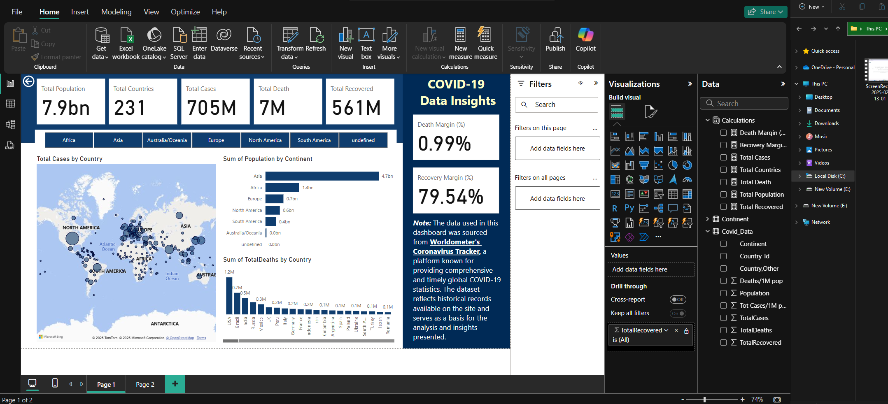
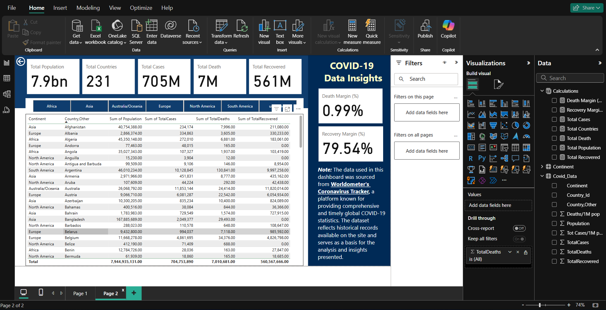

DEAR STEVEN, THIS IS A GOOD JOB!

## COVID-19_Data_Insights

In this project, I analyzed historical global COVID-19 data sourced from Worldometer. The dashboard offers a clear and interactive overview of key metrics, including confirmed cases, death margins, and recovery margins. It provides insights into the pandemic's impact over time, helping users better understand global trends and health outcomes. 

(The Covid-19 picture above is downloaded from google)

# 📘 Introduction

This is a COVID-19 analysis done with Power BI.  
I analyzed historical global COVID-19 data sourced from Worldometer. The dashboard provides an interactive and comprehensive visualization of global metrics such as total population, affected countries, confirmed cases, total deaths, and recoveries.

## 🧠 Problem Solving
The goal of this project is to provide a data-driven overview of how COVID-19 affected different continents and countries. The dashboard enables users to explore data interactively and draw useful insights for research and decision-making.

## 🌐 Data Sources
-  Historical global COVID-19 data sourced from [Worldometer COVID-19 Tracker](https://www.worldometers.info/coronavirus/)

## 🛠️ Skills & Concepts Demonstrated
PowerBI concepts like:
- Data Visualization (Maps, Bar Charts, KPIs, Table view)
- Report Design in Power BI
- Developing general DAX calculations that deal with text and numbers
- Data Modelling
- Data Cleaning
- Measures
- Filters
- Tooltips
- Buttons
- Creating columns

## 📊  Data Visualization
The report consists of 2 pages
- page 1 
- page 2 

---

## 🔍 Insights and Recommendations

### **Key Insights**
- **Global Death Margin**: 0.99%  
- **Global Recovery Margin**: 79.54%  
- The **USA, India, and Brazil** reported the highest confirmed case and death counts.  
- **Asia**, despite being the most populous continent, recorded a **low recovery margin of 48.99%**.  
- **Australia/Oceania** recorded the **highest recovery margin of 98.12%**, indicating highly effective health strategies.  
- **Africa** recorded a **recovery margin of 71.62%**, reflecting moderate recovery effectiveness.

### **Recommendations**
- Stakeholders and health organizations should examine strategies used in **Australia/Oceania** to replicate successful recovery approaches in regions with lower recovery margins.
- Support is needed in **Asia and Africa** to enhance healthcare infrastructure, data accuracy, and access to treatment.
- These insights can inform **public health policies, NGO campaigns**, and investment decisions targeting pandemic response and recovery efforts.
- Global death margin: **0.99%**

## 📂 Files Included

- [Covid_19_Analysis.pbix](./Covid_19_Analysis.pbix) – Power BI report file  
- [Covid_19_page_1.png](./Covid_19_page_1.png) – Dashboard screenshot 1
- [Covid_19_page_1.png](./Covid_19_page_2.png) – Dashboard screenshot 2

## ⚠️ Disclaimer  
**COVID-19 Coronavirus Pandemic**  
**Last updated: April 13, 2024, 01:00 GMT**  

Please note that the data used in this project was sourced from [Worldometer](https://www.worldometers.info/coronavirus/), a publicly available website. While it provides timely and comprehensive statistics, **it may not always represent the most accurate or up-to-date official data**, as figures can vary based on country reporting standards and updates. This dashboard is intended for educational and analytical purposes only.

